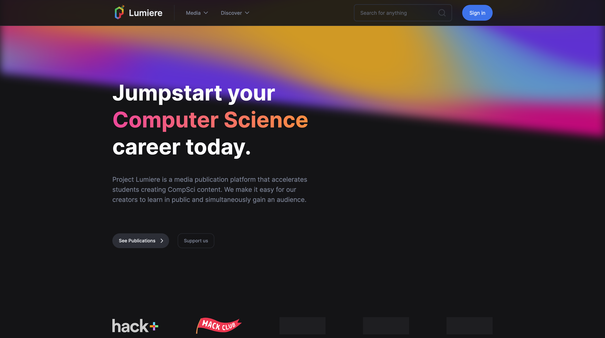

# Project Lumiere

We are sponsored in full by Hack+ and Vercel.

Welcome to the repository of Project Lumiere, the CS publication platform with superpowers! This repository houses the source code for the website in its entirety, built with [Next.js](https://nextjs.org)
and [TailwindCSS](https://tailwindcss.com) and deployed on [Vercel](https://vercel.com?utm_source=lumiere&utm_campaign=oss).

## Contributing

We would love for you to contribute to the project wherever you see fit. Before you begin, though, we would recommend
taking a look at the [contributing guide](https://github.com/project-lumiere/lumiere/blob/main/CONTRIBUTING.md)
before you begin. That way, it will be easier for us to take a look at your contribution.

## License

This repository is open-sourced with an [MIT License](https://github.com/project-lumiere/lumiere/blob/main/LICENSE).
